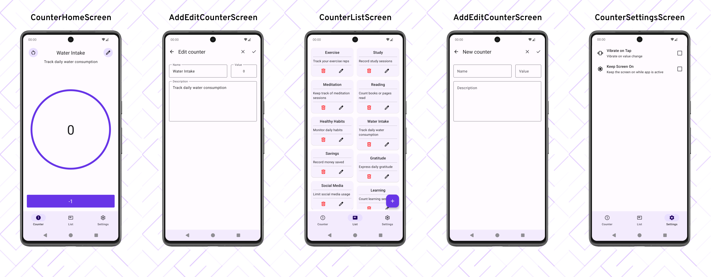

# Counter

Welcome to Counter, your all-in-one app for effortless counting! Designed with three dedicated screens—Home, List, and Settings—Counter caters to all your counting needs. Efficiently manage and track counters on the Home screen, each with personalized names and values. Navigate through your counters with ease on the List screen, providing a quick overview of your counting endeavors. Dive into the Settings screen to explore customization options, tailoring the app to fit your preferences. Simplify your counting tasks and enhance your experience with Counter.

## Download

## All Screens

## Technologies Used

- **Jetpack Compose**: This modern UI toolkit is the cornerstone for constructing the native Android user interface, ensuring a contemporary and user-friendly design.

- **Navigation Component**: Navigation Component is a Jetpack library that simplifies the implementation of navigation in Android apps. It provides a consistent and robust way to navigate between different screens and manage the navigation flow.

- **Room**: Room is a persistence library that provides an abstraction layer over SQLite for database operations. It is part of the Android Jetpack library and simplifies data storage and retrieval in Android apps.

- **Hilt**: Hilt is a dependency injection library for Android that is built on top of Dagger. It simplifies the process of dependency injection, making it easier to manage and organize dependencies in your Android app.

- **DataStore**: DataStore is a modern data storage solution for managing and persisting key-value pairs, making it suitable for storing simple data in Android apps. It is a replacement for SharedPreferences, offering a more robust and reactive approach to data storage.

## Installation

To set up and run Counter on your local environment, follow these steps:

1. Clone the repository to your local machine.
2. Open the project in Android Studio.
3. Proceed to build and run the project on either an Android device or an emulator.

## Usage

Once Counter is installed and launched on your device, follow these steps:

1. Create a new counter or select an existing one on the Home screen.
2. Customize each counter with a unique name and initial value.
3. Easily manage and track your counters with intuitive controls.
4. Navigate through your counters on the List screen.
5. Tailor your experience by exploring customization options in the Settings screen.

## License

This project is licensed under the [Apache License 2.0](./LICENSE).